# crackme
## Краткое описание

Задача данного проекта заключалась в том, чтобы взломать чужой исполняемый файл, не изменяя его. А также написать свою программу с двумя уязвимостями и предоставить ее для взлома своему другу.

Для этого использовалась операционная система DOS, а именно ее эмулятор DOSBox.

## Суть задачи

Создается программа, запрашивающая у пользователя пароль. В случае, если он правильный, выводится "Access granted". Иначе - "Access denied"

В программу должны быть заложены две уязвимости, с помощью которых возможно взломать программу, не изменяя бинарный файл

Одна уязвимость должна быть простая - которую видно сразу<br>
Вторая - более сложная

# Взлом

Для анализа и взлома я использовал следующие программы:

1. **IDA Disassembler** (The Interactive Disassembler)
2. **Turbo Debugger**

## 1 этап - дизассемблирование

Первым делом я открыл предоставленный исходный файл (crackme.com) в дизассемблере IDA в режиме Disassembly (16-bit), чтобы проанализировать код и найти возможные уязвимости

<p align="center">
    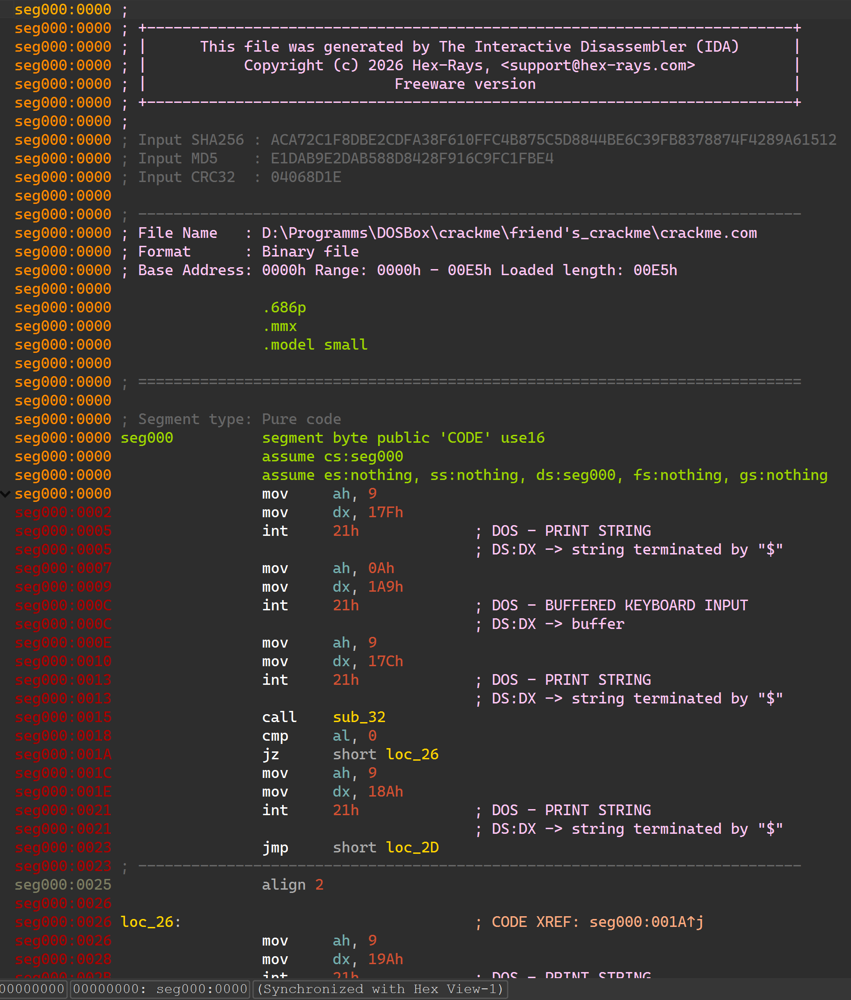
</p>

Видно, что программа содержит в себе основную часть, и одну функцию sub_132

Анализируя далее, можно предположить, что в конце программы хранятся данные. Открыв их в режиме "Data" увидим следующее:

<p align="center">
    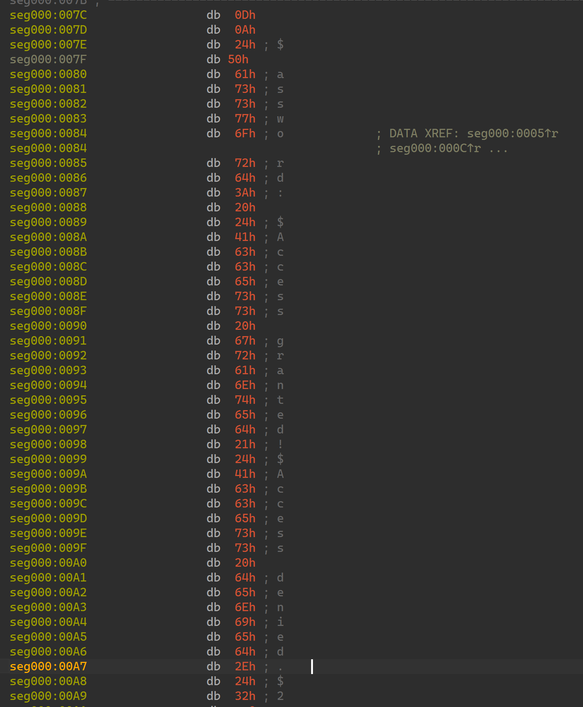
</p>

Таким образом, следующие сообщения лежат по адресам:
| Адрес         | Сообщение |
| --- | --- |
|   017F  | 'Password: $' |
|   018A  | 'Access granted!$' |
|   019A  | 'Access denied.$' |

## Анализ основной части программы

<p align="center">
    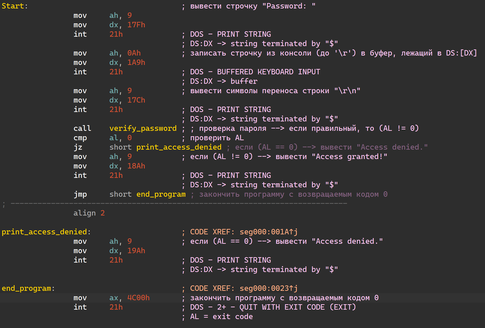
</p>


1. Вначале выводится строка "Password: " с помощью 21 прерывания (09h функция DOS-а)<br>
2. Затем с помощью 0Ah функции DOS-а ввод из консоли считывается в буфер лежащий по адресу 1A9h до символа '\r'
3. После чего выводится символ новой строки
4. Далее происходит вызов функции, предположительно она проверяет пароль и меняет флаг, лежащий в регистре AL
5. Проверяется регистр AL, в случае, если он равен нулю, происходит прыжок на метку, выводящую строку "Access denied."
6. Иначе, выводится строка "Access granted!" и вывод строки из п.5 пропускается
7. Наконец, программа завершается

<p align="center">
    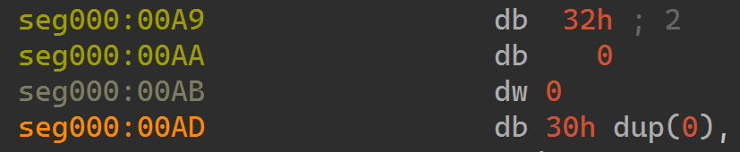
</p>

По адресу 01A9 лежит длина буфера (32h = 50d байт), после чего байт с фактической длиной введенной строки и 50 байт, заполненных нулями (сам буфер)

## Анализ функции verify_password

<p align="center">
    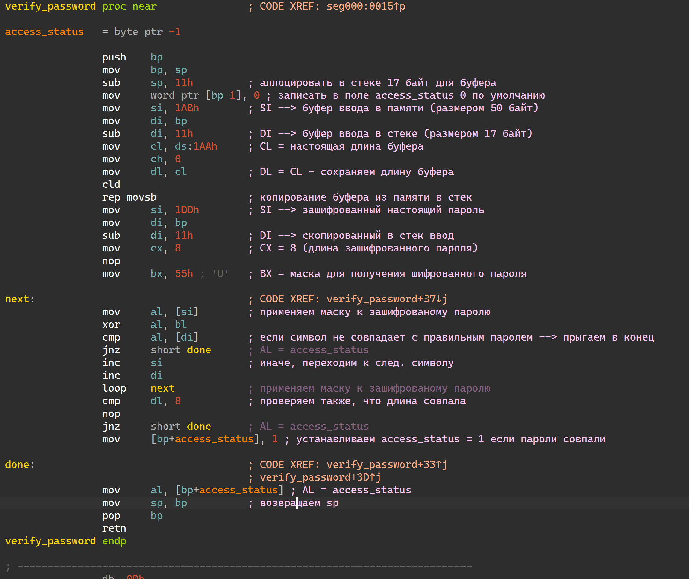
</p>

Данная функция использует стек для хранения введенной строки. Она выделяет 17 байт в стеке и копирует буфер из памяти
### **Ключевой момент**
В стеке выделяется память размером 11h = 17d байт (1 байт для флага верности пароля и 16 байт для хранения строки с паролем), однако копируется столько, сколько фактически было записано в буфер (может быть больше 16-и байт). Изначальный размер буфера 50 байт, а выделено в стеке под строку лишь 16 байт!<br>

Это и является уязвимостью! Таким образом, мы сможем подать на ввод больше чем 16 байт и, переполнив место в стеке, отведенное под хранение строки, поменять важные поля в стеке

## 1-я уязвимость
Флаг правильности пароля (я назвал его access_status) хранится в стеке сразу после 16 байт буфера, после чего копируется в регистр AL и проверяется в теле программы. <br>

На рисунке представлен пример содержимого стека во время выполнения функции verify_password:<br>
1. Адрес возврата из функции
2. Сохраненное значение регистра BP до входа в функцию
3. Флаг правильности пароля размером в 1 байт
4. Затем идут 16 байт, выделенные в стеке под хранение строки с введенным паролем.
>В качестве примера был введен пароль "PASSWORDPASSWORD" (он полностью занимает выделенное под него место, так как длина пароля 16 букв). BP-17 указывает на начало этой строки. При этом ее хранение происходит вверх по стеку. Таким образом сверху стека мы увидим байты, отвечающие буквам 'D', 'R', 'O' и так далее до 'S', 'S, 'A', 'P' снизу

<p align="center">
    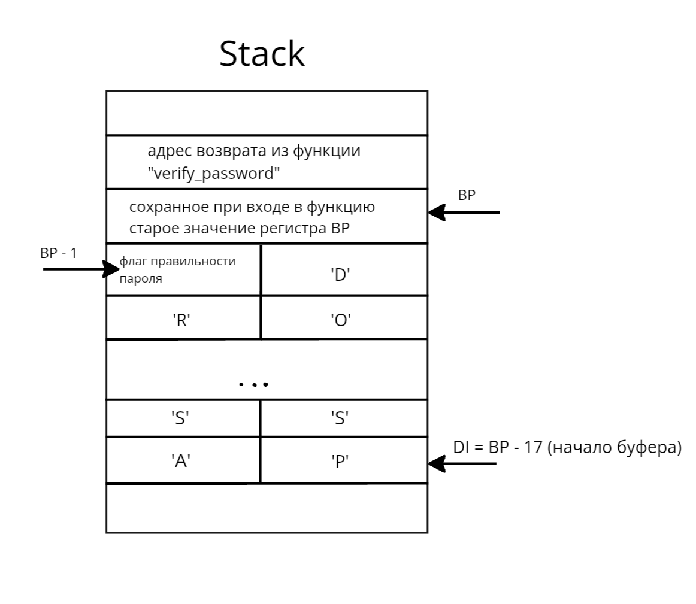
</p>

Таким образом, подав на ввод 16 мусорных байт и ненулевой байт после, я перетру изначальное значение флага access_status в стеке, и программа будет считать, что пароль верный

С помощью расширения VSCode **Hex Editor** от Microsoft, я создал бинарный файл, содержащий 16 нулевых байт, после чего байт равный 01 (для подмены флага проверки) и 0D (символ переноса каретки CR) для окончания ввода

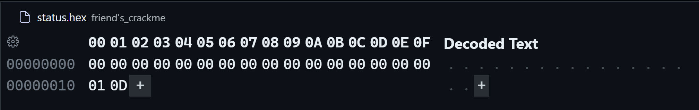

Перенаправив в DOS-е ввод в программу командой
```powershell
crackme.com < status.bin
```
Получим сообщение об успешном вводе пароля

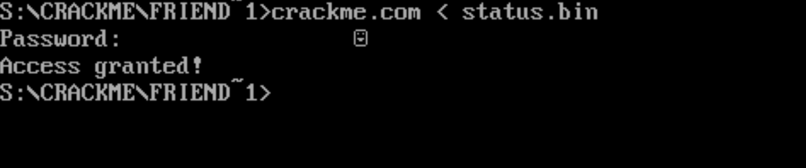

## 2-я уязвимость
Сразу после флага access_status хранится предыдущее значение регистра BP (однако оно никак не влияет на исполнение программы, так как не используется вне этой функции).<br>
После чего хранится адрес возврата из функции verify_password.

Заменив адрес возврата, мы можем передать управление в любое место программы, в том числе на вывод строки о предоставлении доступа ("Access granted"), тем самым обманув программу.

#### Просчитаем адрес команды для подмены

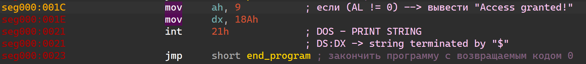

Удобнее и проще всего будет передать управление команде, выводящей нужную строчку о правильном пароле, миновав проверку, за чем последует завершение программы.

Необходимый адрес 011C. Используется **Little-endian**, из-за чего записывать в ввод нужно будет в обратном порядке - **1C01**

Затрем сохраненное значение BP нулями, так как оно все равно не будет использовано

Поэтому нам нужно подать на ввод 19 мусорных байт, после чего записать 1С 01 - новый адрес возврата и символ переноса каретки 0D для завершения ввода

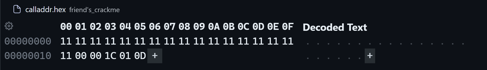

Перенаправив ввод из файла *calladdr.bin* получим ожидаемый результат

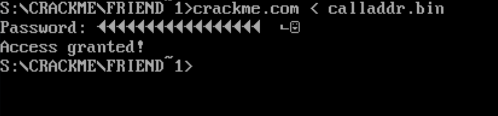

## Тяжелая уязвимость

Для получения сообщения о правильном вводе также можно создать вспомогательную программу - ***резидент-эмиттер*** (*emitter.com*).

Данная программа создает резидента, подменяющего 21h прерывание (прерывание функций DOS-а), а именно 0ah функцию (ф-я получения буферизованного ввода, использующаяся во взламываемой программе)

Таким образом, мы изменим поведение основной программы и получим нужный результат.

Резидент будет подменять код основной программы, убирая проверку флага access_status, хранящегося в регистре AL, перед выводом сообщения о предоставлении доступа.

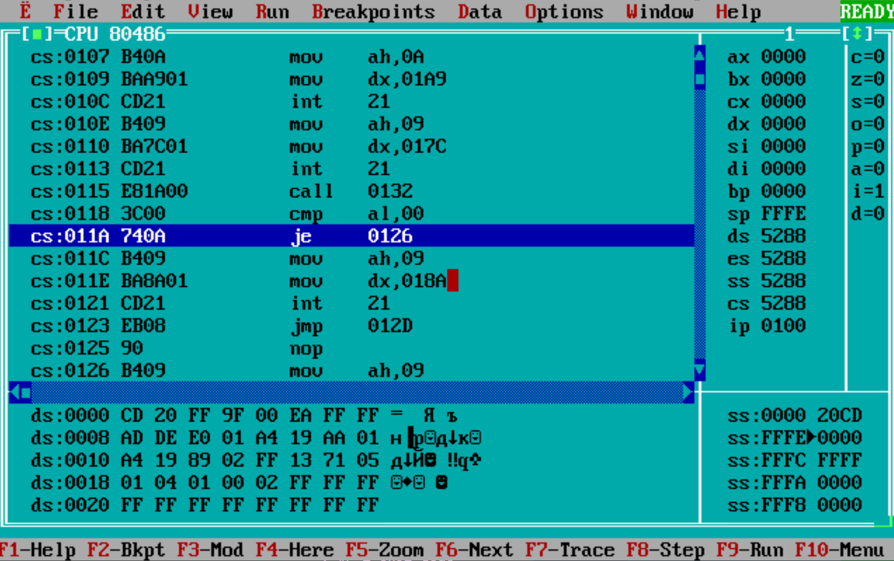

Заменив байты, отвечающие за команду
```asm
je 0126
```
на байты, отвечающие команде
```asm
NOP NOP
```
(не исполнять никакую операцию), я уберу проверку на правильность пароля и программа независимо от ввода будет выводить "Access granted"

-------------------------------------------------------------

Для этого в резидентной функции я достаю регистр CS из стека (он выталкивается в стек при вызове прерывания вместе с флагами и IP в IRET кадре)

После этого я переписываю значение в памяти по адресу CS:[0126h] и CS:[0127h] на NOP-ы
(полный код в файле **emitter.asm**)
```asm
    ; AX = CS from iret frame
    ; when an int called in stack pushed:
    ; [FLAGS]
    ; [CS] <--- bp + 10
    ; [IP] <--- bp + 8
    ; i pushed
    ; [old AX, old DI, old BP, old ES] <--- bp
    mov ax, ss:[bp + 10]
    ; ES = old CS
    mov es, ax

    ; DI = abs address of command JZ checking access status for 0
    mov di, PATCH_ADDR

    ; verify that int call was in program we want to crack:
    ; at PATCH_ADDR should be jz
    cmp byte ptr es:[di], JZ_BYTECODE
    jne @@CleanUp
    ; AL = nop
    mov al, NOP_BYTECODE
    ; store NOPs instead of JZ <jump addr>
    ; es[di++] = al (JZ --> NOP)
    stosb
    ; es[di++] = al (<jump addr> --> NOP)
    stosb
```

Запустив преждевременно резидентную программу, я получаю вывод о правильном пароле:

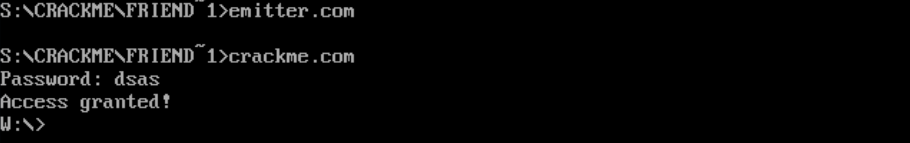

## Моя программа crackme

>Для своего друга я также написал свою *crackme.asm*, содержащую две уязвимости, а также сам взломал свою программу для проверки

Моя программа сверяла хэш вводимого пароля, высчитывающийся по алгоритму djb2, с посчитанным заранее. При равенстве хэшей выводилось сообщение о правильности пароля и разрешении доступа. Иначе - об отказе в предоставлении доступа.

Моя программа не проверяла длину вводимой строки и позволяла переполнить буфер, что и являлось главной уязвимостью.

#### Обе уязвимости заключались в переполнении буфера:
----------------

1. Поле с хэшом лежит в памяти сразу после буфера ввода, что позволяет переписать хэш на необходимый

2. С помощью достаточно длинного ввода можно переписать в стеке адрес возврата из функции получения ввода на адрес команды, выводящей строчку о предоставлении доступа

## Итоги
С помощью переполнения буфера и программы-резидента, я взломал программу проверки пароля.

Данный проект учит пользоваться Debugger-ом и Disassembler-ом, а также показывает на примере, насколько легко отсутствие проверки на переполнение буфера может привести к уязвимостям в программе
